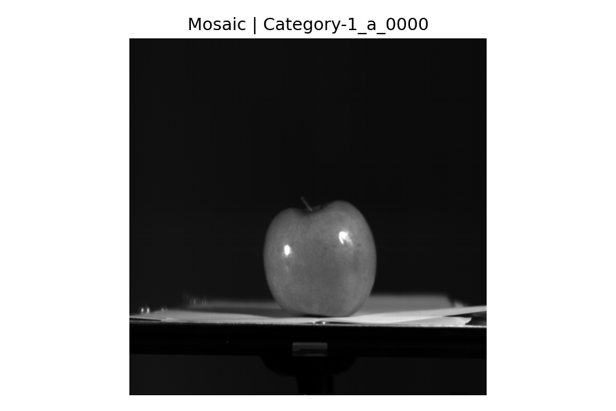
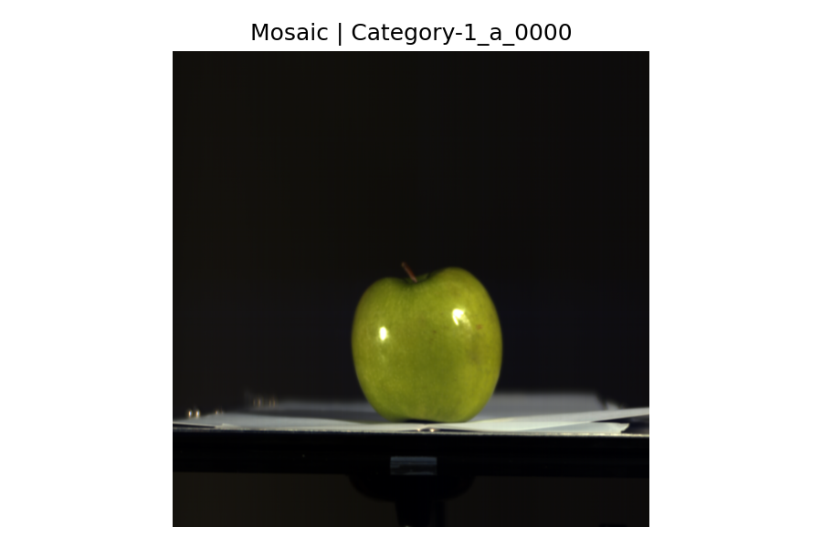
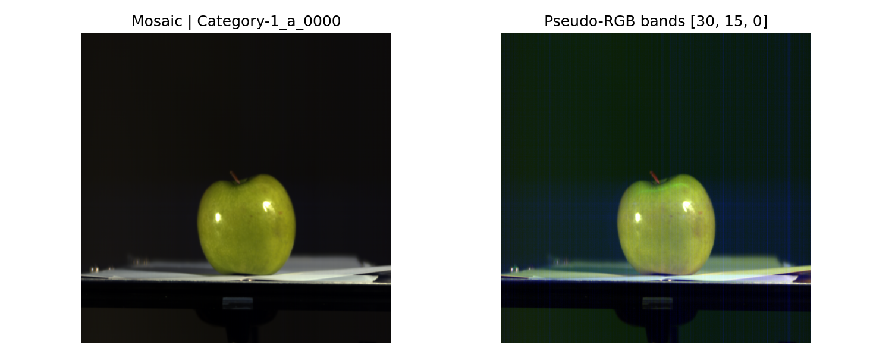
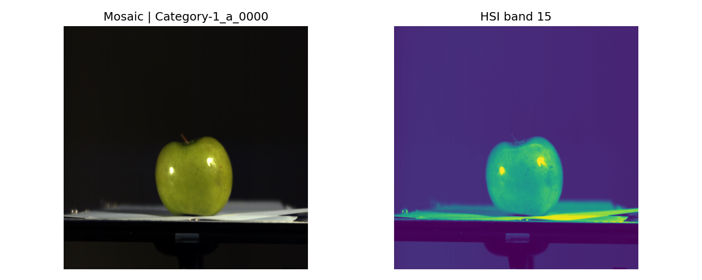
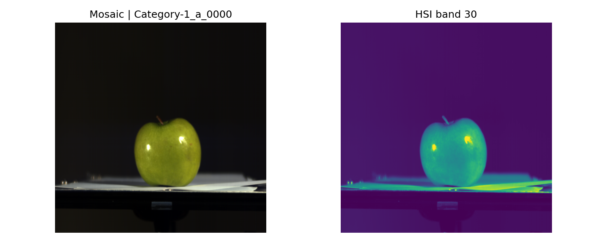
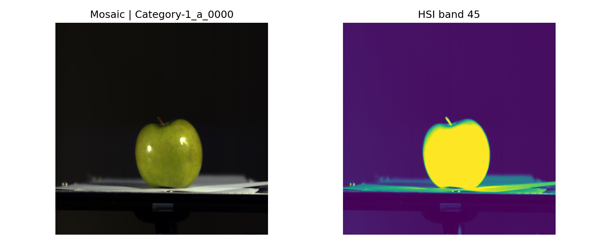

# Preview utility (src/utils/preview.py)

This tool helps you quickly “see” Track 1 data:

- The input mosaic (single-channel 2×2 RGGB CFA) as either grayscale or a quick demosaic to colour
- The output hyperspectral cube as either a single band (grayscale) or a pseudo‑RGB made from 3 selected bands

It’s meant for sanity checks and intuition building, not for publication‑grade rendering.

---

## What the files are

- Mosaic (input): a single image plane with RGGB pattern. Shape `(1, H, W)` after loading.
- Hyperspectral cube (target): 61 bands spanning ~400–1000 nm in 10 nm steps. Shape `(61, H, W)`.
  - Index 0 → ~400 nm (violet/blue end)
  - Index 15 → ~550 nm (green)
  - Index 30 → ~700 nm (red)
  - Index 45 → ~850 nm (near‑infrared)

---

## Example outputs (from your dataset)

Input (mosaic, grayscale)



Input (mosaic, quick demosaic to colour)



Pseudo‑RGB from HSI (example image below uses bands 30, 15, 0 — recommended default)



Single HSI bands (grayscale)

- Band 15 (~550 nm, green): 
- Band 30 (~700 nm, red): 
- Band 45 (~850 nm, NIR): 

> Note: Single bands are auto‑contrast‑normalized in the viewer for visibility.

---

## How to run

All commands are from the repo root:

```
python -m src.utils.preview --data-root data/track1 --index 0 --input-only --grayscale-input
python -m src.utils.preview --data-root data/track1 --index 0 --input-only
python -m src.utils.preview --data-root data/track1 --index 0 --bands 30 15 0
python -m src.utils.preview --data-root data/track1 --index 0 --band 15
python -m src.utils.preview --data-root data/track1 --index 0 --band 30
python -m src.utils.preview --data-root data/track1 --index 0 --band 45
```

Useful flags:

- `--input-only`: show just the mosaic
- `--grayscale-input`: show mosaic in grayscale instead of colour demosaic
- `--band N`: show one spectral band (grayscale)
- `--bands R G B`: show pseudo‑RGB using 3 bands (now defaults to `30 15 0`, closer to R,G,B ends)
- `--out-path path.png --no-show`: save to file (no window)

---

## Intuition: what bands “should” look like (green apple example)

Think of a hyperspectral pixel as a spectrum: how much light is reflected at each wavelength. Objects have characteristic spectra.

For a green apple under white light:

- Around 540–560 nm (green), reflectance is relatively high. The apple looks bright in band ~15 (~550 nm).
- Around the red edge (~650–700 nm), reflectance for many green surfaces is lower compared to green; band ~30 (~700 nm) tends to look dimmer than the green band (though not black).
- In the near‑infrared (NIR, ~750–900 nm), vegetation and many biological tissues often reflect strongly due to internal structure. Bands around ~850 nm (band 45) can become quite bright even though they are not visible to the human eye.

Reading the example images above:

- The green apple is prominent in band 15 (550 nm), aligning with the human‑visible green peak.
- In band 30 (~700 nm), features may appear flatter or darker on green surfaces—consistent with lower red reflectance.
- In band 45 (~850 nm), the apple becomes brighter again, demonstrating the typical NIR reflectance rise.

This “green high → red lower → NIR high” pattern is common for green vegetation and can help sanity‑check your data and model outputs.

About pseudo‑RGB band choices:

- A practical triplet that often looks natural on many scenes is **(30, 15, 0)**, roughly mapping to (red edge, green, blue‑violet). You can generate it with:

```
python -m src.utils.preview --data-root data/track1 --index 0 --bands 30 15 0 --out-path src/utils/images/hsi_pseudorgb_30_15_0.png --no-show
```


---

## Why the input mosaic looks different

- The mosaic is a single channel sampled through a 2×2 RGGB colour filter array. Displaying it as grayscale shows the raw intensity pattern; demosaicing estimates an RGB image by interpolating missing colours per pixel.
- The quick demosaic here uses simple bilinear interpolation—good enough for preview, not for rigorous colour science.
- The demosaic is only a convenience for visual checks; models in Track 1 learn from the raw mosaic to predict the full 61‑band cube.

---

## How the mosaic measurement is formed (plain‑English model)

For a pixel that sits under an R/G/B filter on the sensor, the value the camera records is proportional to the energy that makes it through that filter. Conceptually:

- Measurement at a pixel with channel c ≈ integral over wavelength of:
  - surface reflectance R(x, y, λ) in [0, 1]
  - times illuminant spectrum E(λ) (how much light at each λ)
  - times the channel’s spectral sensitivity S_c(λ) (how strongly that pixel “sees” each λ)
  - plus sensor gain/offset and noise

Key terms:

- Spectral sensitivity S_c(λ) is not a constant; it is a smooth curve vs wavelength. RGB channels are broad, overlapping lobes (not narrow lines).
- Surface reflectance R(x, y, λ) is a property of the scene/object; it says what fraction of incident light is reflected at λ (independent of the camera).
- The illuminant E(λ) is the light source’s spectrum (D65 daylight, tungsten, LED, etc.). Change the light, change E(λ).

Because the sensor has a mosaic of colour filters, a single raw frame contains interleaved samples: R at some locations, G at two locations, and B at others (RGGB). Demosaicing estimates the missing colours to create a 3‑channel RGB image.

---

## “Bayer sampling” vs a normal RGB photo

- Most commodity RGB cameras internally use a Bayer (RGGB) CFA—so they start from a single‑channel mosaic just like this. The difference is they immediately run a full camera pipeline:
  - demosaicing → white balance → colour correction (matrix to camera/sRGB space) → tone/gamma → denoise/sharpen → JPEG
  - You usually never see the raw mosaic unless the camera supports RAW.
- In our Track 1 dataset you are given the mosaic directly (pre‑pipeline), so you can learn the mapping to a hyperspectral cube. Two consequences:
  - There are twice as many G samples as R or B (RGGB), which is why the mosaic often looks “greenish” after demosaic previews.
  - The mosaic integrates only over the RGB spectral lobes; it cannot “see” NIR, which is why HSI bands in the NIR reveal structure the mosaic cannot.

---

## Why `.npy` for mosaic and `.h5` for HSI?

- `.npy` (NumPy) is a simple, fast format for a single array. The mosaic is one 2D (or 3D with a 1‑channel) array per image, so `.npy` keeps I/O cheap and straightforward.
- `.h5` (HDF5) is a hierarchical container that can hold large datasets with optional compression, chunking, and metadata. Hyperspectral cubes are bigger (61×H×W) and sometimes accompanied by extra fields; `.h5` scales better for these multi‑band arrays and keeps everything under a consistent key (we read dataset `'cube'`).

Practical notes:

- You load mosaic with `np.load(path)`; you load HSI with an HDF5 reader and access `f['cube']`.
- HDF5 supports compression (e.g., gzip) which reduces disk space for large cubes; `.npy` is typically uncompressed but very fast.

---

## How the Track 1 mosaic was generated (per challenge docs)

The competition documentation states the released mosaics were created from the HSI ground truth using a camera‑like but ISP‑free pipeline:

1) Render reflectance to linear RGB (D65)
- Convert reflectance R(λ) to tristimulus XYZ by integrating R(λ)·E_D65(λ) against the CIE 1931 2° CMFs (unit‑normalized so a perfect diffuser yields Y=1).
- Convert XYZ → linear sRGB (D65) via the standard 3×3 matrix.
- Remain linear: no gamma, no white balance, no tone mapping. Clip negatives to 0.

2) Bayer mosaicing (RGGB)
- Apply the 2×2 RGGB colour filter array so each pixel samples exactly one of {R,G,B} according to the tile pattern (even/odd rows/cols).
- The result is a single‑channel mosaic (RAW‑like, pre‑ISP).

3) Normalization and output
- Store as float32 in [0,1].
- No demosaic, colour correction, gamma, sharpening, or JPEG.

This produces mosaics that are pixel‑aligned to the HSI cubes while avoiding vendor‑specific ISP steps, making the learning task closer to real RAW mosaics.

---

## Tips

- Pseudo‑RGB from HSI is arbitrary: you choose which three bands to map to R/G/B. Try different triplets to highlight materials.
- Single‑band views are great for spotting wavelength‑dependent contrast (e.g., specular highlights move, textures change with band).
- If something looks wrong everywhere (e.g., all bands uniform), double‑check file paths and scaling.

---
